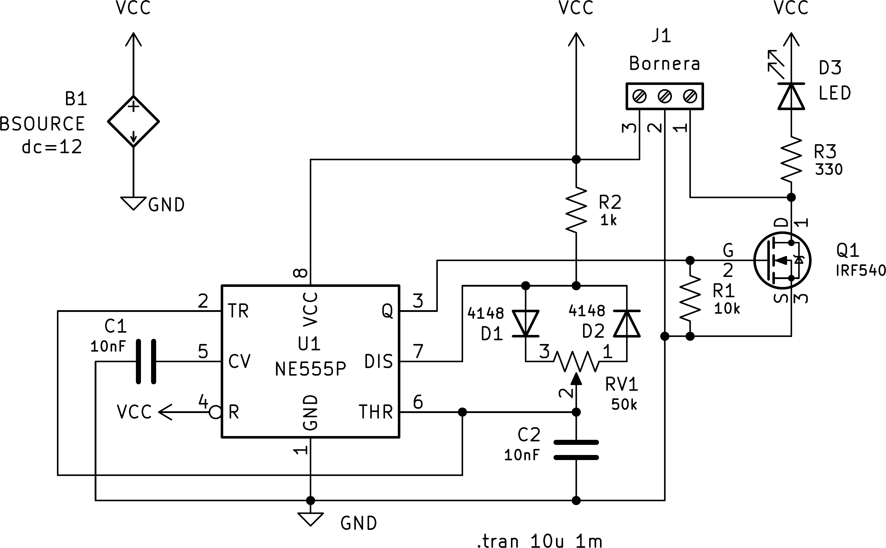
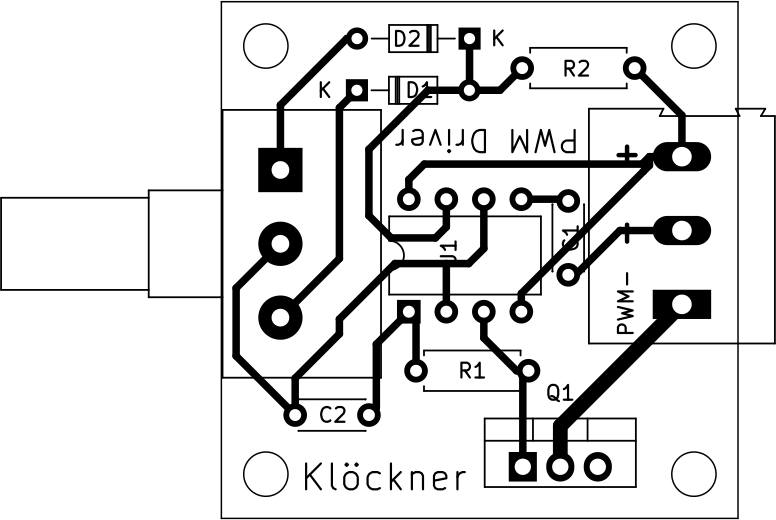

# Controlador PWM: Diseño de Placa Base y Gabinete

Introducción al Diseño Asistido por Computadora (86.70) - FIUBA  
Martin Klöckner ([mklockner@fi.uba.ar](mailto:mklockner@fi.uba.ar)) - 9 Diciembre 2024  

## Introducción

En el presente trabajo se diseña la placa base y el gabinete de un controlador
modulado por ancho de pulsos. Para el diseño de ambos componentes se utilizan
programas de computadora, en particular KiCAD para el diseño y simulación de la
placa base y FreeCAD para el diseño del gabinete y modelos 3D de componentes de
la placa. Al final del trabajo se ensambla y se indican los costes de
producción.

## Esquemático y Simulación

El circuito se trata de un controlador modulado por ancho de pulsos (controlador
PWM en adelante) el diseño del circuito se obtuvo del post del usuario Creative
Creator en el sitio web [hackster.io](hackster.io).[^1]

[^1]: Creative Creator. (2020, Mar 17). LED Dimmer Circuit with 555 Timer. *hackster.io*. [https://www.hackster.io/dhritimanhb2015/led-dimmer-circuit-with-555-timer-bc30f7](https://www.hackster.io/dhritimanhb2015/led-dimmer-circuit-with-555-timer-bc30f7)

En la figura \ref{schematic} a continuación se muestra el esquemático completo
dibujado en KiCAD siguiendo el diseño mencionado previamente. Además se agrega
una fuente de alimentación de 12 volts, B1, junto con un LED y una resistencia
como carga, esto para simular el circuito, como se muestra en la directiva de
simulación de LTSpice, la cual indica una simulación de tipo transitoria con
intervalo de tiempo de 10 us y un total de muestra de 2 ms.

{ width=80% }

El circuito se trata de alimentar un MOSFET Canal-N con la señal proveniente de
un timer 555, el cual genera una señal PWM cuyo ciclo de trabajo es controlado
por el potenciómetro RV1.

La salida del timer 555 se conecta al terminal Gate del MOSFET, el terminal
Source se conecta a tierra, y el terminal Drain se conecta al negativo de la
carga, de esta manera cuando el MOSFET esté en corte la carga no recibe
alimentación y por ende permanecerá apagada, por el contrario cuando el MOSFET
esté encendido, circulará corriente y la carga se encenderá.

En la figura \ref{pwm_sig}, se muestra la salida del timer 555 cuando se varía
la posición del potenciómetro RV1, se puede ver como cambia el ciclo de trabajo
de la señal, es decir, se controla el tiempo en que la señal permanece activa,
el máximo siendo la señal activa en todo momento, y el mínimo, la señal
inactiva o apagada en todo momento.

{ width=100% }

El timer 555 genera una señal PWM de frecuencia relativamente constante, como se
puede ver en la figura \ref{pwm_sig} en la cual aun variando el ciclo de trabajo
el periodo sigue siendo aproximadamente el mismo: aproximadamente 0.405 ms. Esta
frecuencia fija es controlada por el capacitor C2, la resistencia R2 y el valor
total del potenciómetro RV1; siendo el calculo para la frecuencia el siguiente:

$$f=\left( 5\cdot (R1+RV1)*C2 \right)^{-1}$$

Con los valores elegidos, $1\ k\Omega$ para R1, $50k\Omega$ para RV1 y $10nF$
para C2, la frecuencia resulta:

$$f=\left( 5\cdot 51k\Omega*10 nF \right)^{-1} \Rightarrow \boxed{f \approx 2222 Hz}$$

Teniendo en cuenta que la frecuencia es aproximadamente 2000 Hz, la carga se
enciende y apaga muy rápido, utilizando un diodo LED como carga, y variando el
ciclo de trabajo de la señal PWM se enciende y apaga el LED muy rápido, más
rápido de lo que los ojos humanos pueden percibir, por lo que se logra un efecto
de atenuación del LED, en función de la posición del potenciómetro. Este
controlador PWM también puede ser utilizado para variar la velocidad de motores
de corriente continua de igual forma en que se varia la intensidad del LED,
encendiendo y apagando la fuente muchas veces por segundo.

## Diseño de Placa Base

En la figura \ref{pcb} se muestra una vista superior de la placa base del
circuito, también realizado utilizando KiCAD. Cabe destacar que en la figura se
ha ocultado el plano a tierra y la placa en sí, en donde se colocan los
componentes, tiene opacidad nula de manera que se aprecien mejor los
componentes. 

La mayoría de las pistas de la placa base tienen un espesor de 20 mils, solo en
la pista de salida (pin central del MOSFET Q1) se ha utilizado un diámetro de
aproximadamente 40 mils (1mm) puesto que por ahí circula la corriente de
la carga, la cual puede llegar a valores muy altos, en principio limitado por
los parámetros máximos de la fuente y el MOSFET Q1.

<!-- la cual luego será impresa utilizando una maquina CNC, -->

{ width=60% }

Para la vista en 3D de la placa, se han utilizado los modelos disponibles en
KiCAD, a excepción de los modelos del potenciómetro, el transistor de paquete
TO-220 y la bornera, debido a que, en el caso del potenciómetro y la bornera no
se incluyen en la librería estándar de KiCAD, en cuanto al paquete TO-220 se
utilizó una versión modificada del modelo incluido en la librería estándar de
KiCAD, en esta version modificada se cortan los pines de modo que se asemeje a
una version del mismo ya montado y soldado en la placa.

En la figura \ref{vistas_mod_faltantes} se pueden ver vistas axonométricas de los
modelos propios diseñados en FreeCAD. En la figura \ref{vista_mod_potenciometro}
se muestra el modelo del potenciómetro, en la figura \ref{vista_mod_bornera} se
muestra el modelo de la bornera y en la figura \ref{vista_mod_to220}, se muestra
la version modificada del paquete TO-220.

\begin{figure}[H]%
  \centering
  \subfloat[\centering Potenciómetro\label{vista_mod_potenciometro}]{
    {\includegraphics[width=0.20\textwidth,height=\textheight]{
      img/pote.png
    }}
  }
  \hspace{3em}
  \subfloat[\centering Bornera\label{vista_mod_bornera}]{
    {\includegraphics[width=0.15\textwidth,height=\textheight]{
      img/terminal-block.png
    }}
  }
  \hspace{3em}
  \subfloat[\centering TO-220\label{vista_mod_to220}]{
    {\includegraphics[width=0.10\textwidth,height=\textheight]{
      img/to220.png
    }}
  }
  \caption{Vistas axonométricas de los modelos 3D propios}
  \label{vistas_mod_faltantes}
\end{figure}

En ambos diseños propios (potenciómetro y bornera) se puede ver que el nivel de
detalle no es el máximo, ya que por ejemplo en la bornera faltarían los
tornillos, o en el potenciómetro faltaría modelar la soldadura de los pines con
la placa del mismo; se optó por este nivel de detalle ya que como veremos es
suficiente para modelar el gabinete que contendrá la placa base. En caso de
querer un mayor detalle, es más conveniente recurrir a librerías de terceros en
caso de que estén disponibles.

<!-- 
como pueden ser el diseño de bornera[^2] de Daniel Školník o el diseño de
potenciómetro[^3] de Vasily Kashirin.

[^2]: Daniel Školník (2021, Nov 16), Screw terminal DG-301 5mm, *grabcad.com*. [https://grabcad.com/library/screw-terminal-dg-301-5mm-1](https://grabcad.com/library/screw-terminal-dg-301-5mm-1)
[^3]: Vasily Kashirin (2021, Mar 8), Alpha RV16AF-20, *grabcad.com*. [https://grabcad.com/library/alpha-rv16af-20-1](https://grabcad.com/library/alpha-rv16af-20-1)

-->

## Diseño de Gabinete

Para el diseño del gabinete se exporta la vista en 3D de la placa base de
KiCAD, y se importa en FreeCAD, teniendo el modelo 3D de la placa base en
FreeCAD, se comienza a diseñar el gabinete en torno a las dimensiones de la
placa, intentando minimizar las dimensiones del mismo e intentando que el
proceso de ensamble sea sencillo y además teniendo en cuenta el tiempo de
impresión del mismo. 

<!--
Además se tiene en cuenta el tiempo de impresión, el
cual no debe superar 75 minutos según el software de impresión CURA utilizando
la impresora 3D prusa i3.
-->

En la figura \ref{vistas_gabinete} se muestra una serie completa de vistas del
gabinete ya finalizado, excluyendo la tapa superior del gabinete, y la tapa
superior del soporte para cables.

\begin{figure}[H]%
  \centering
  \subfloat[\centering Frontal superior izquierda]{
    {\includegraphics[width=0.25\textwidth,height=\textheight]{
      img/frente-arriba-izquierda.png
    }}
  }
  \hspace{3em}
  \subfloat[\centering Superior]{
    {\includegraphics[width=0.25\textwidth,height=\textheight]{
      img/arriba.png
    }}
  }
  \hspace{3em}
  \subfloat[\centering Frontal superior derecha]{
    {\includegraphics[width=0.25\textwidth,height=\textheight]{
      img/frente-arriba-derecha.png
    }}
  }

  \vspace{2em}

  \centering
  \subfloat[\centering Derecha]{
    {\includegraphics[width=0.25\textwidth,height=\textheight]{
      img/derecha-izquierda.png
    }}
  }
  \hspace{3em}
  \subfloat[\centering Frontal\label{gab_vista_frontal}]{
    {\includegraphics[width=0.25\textwidth,height=\textheight]{
      img/frente.png
    }}
  }
  \hspace{3em}
  \subfloat[\centering Izquierda]{
    {\includegraphics[width=0.25\textwidth,height=\textheight]{
      img/derecha-izquierda.png
    }}
  }

  \vspace{2em}

  \centering
  \subfloat[\centering Frontal inferior izquierda]{
    {\includegraphics[width=0.25\textwidth,height=\textheight]{
      img/frente-abajo-izquierda.png
    }}
  }
  \hspace{3em}
  \subfloat[\centering Trasera]{
    {\includegraphics[width=0.25\textwidth,height=\textheight]{
      img/atras.png
    }}
  }
  \hspace{3em}
  \subfloat[\centering Frontal inferior derecha]{
    {\includegraphics[width=0.25\textwidth,height=\textheight]{
      img/frente-abajo-derecha.png
    }}
  }
  \caption{Vistas sin Tapa del Gabinete Modelado en FreeCAD}
  \label{vistas_gabinete}
\end{figure}

Las dimensiones del gabinete visto de frente (figura \ref{gab_vista_frontal})
son 48 mm de ancho, 31 mm de alto y 56 mm de profundidad, para las paredes y la
tapa superior del gabinete se utilizó 3 mm de espesor. Con estas dimensiones el
tiempo de impresión resulta de 68 minutos según SuperSlicer (software similar a
ultimaker CURA), utilizando la impresora 3D Prusa i3 MK2S con extrusor de 0.4 mm
y altura de capa de 0.35 mm.

<!--
### Vista sin Tapas
### Vista con Tapas

\begin{figure}
  \begin{subfigure}[htbp]{\linewidth}
    \centering
    \includegraphics[width=0.6\textwidth,height=\textheight]{./pcb.png}
  \end{subfigure}

  \caption{Diseño Placa Base a Partir del Circuito en KiCAD}
\end{figure}
-->

\begin{figure}[H]%
  \centering
  \subfloat[\centering Tapa Superior\label{vista_tapa_superior}]{
    {\includegraphics[width=0.35\textwidth,height=\textheight]{
      img/case_lid.png
    }}
  }
  \hspace{3em}
  \subfloat[\centering Tapa Soporta Cables\label{vista_soporte_cable}]{
    {\includegraphics[width=0.35\textwidth,height=\textheight]{
      img/cable_support_installed_cropped.png
    }}
  }
  \caption{Vistas de Tapa del Gabinete}
  \label{vistas_tapas}
\end{figure}

En la figura \ref{vistas_tapas} se muestran las tapas faltantes que no se
muestran en la figura \ref{vistas_gabinete}.

\pagebreak
## Construcción de la Placa Base

<!--
### Consideraciones

Por la resistencia R2 circulan aproximadamente $11 mA$ según simulación
independientemente de la carga, esta corriente circula cuando el
capacitor C2 se descarga. Esta corriente provoca que la resistencia R2 cuyo
valor es $1000\ \Omega$ deba disipar $V_{CC}\frac{R2}{R2+RV1}\cdot 11mA$, siendo
$RV1$ el valor del potenciómetro. Para el potenciómetro en un $50\%$, la
potencia disipada por R2 resulta:

$$P=12V\cdot \frac{1000\Omega}{1000\Omega + 25000\Omega} \cdot 11mA = 5mW$$

Por lo que con un resistor que soporte potencia de $0.25W$ resulta mas que
suficiente.
-->

Para la producción de la placa base se utilizó un servicio de mecanizado CNC de
una placa de cobre FR4, los componentes se compraron en una tienda de
electronica y luego se soldaron a mano.

### Materiales y Costo de Producción

En la tabla \ref{tabla_precios} a continuación se muestra la lista de materiales
necesarios para el armado de la placa base, también se incluye una lista de
precios de referencia de cada componente obtenidos de la tienda
[Microelectrónica Componentes SRL](https://www.microelectronicash.com/) y al
final se muestra el precio total, el cual resulta $\$13.674,0$ pesos argentinos,
o el equivalente en dolares siendo aproximadamente $\$13,0$.

\vspace{0.00em}
\renewcommand{\arraystretch}{1.25}
\begin{table}[h]
\begin{tabularx}{1.0\textwidth} { 
  | >{\raggedright\arraybackslash}X 
  | >{\centering\arraybackslash}c 
  | >{\centering\arraybackslash}r| }
  \hline
  \textbf{Componente}          & \textbf{Cantidad} & \textbf{Precio [ARS \$]}    \\ \hline
  Capacitor cerámico 10 nF     &    2     &      90,4            \\ \hline
  Diodo 4148                   &    2     &      34,4            \\ \hline
  Bornera triple               &    1     &   1.416,0            \\ \hline
  MOSFET Canal-N IRF 1407      &    1     &   1.823,3            \\ \hline
  Resistencia 330 k$\Omega$    &    1     &      87,3            \\ \hline
  Resistencia 10 k$\Omega$     &    1     &      87,3            \\ \hline
  Resistencia 1 k$\Omega$      &    1     &      87,3            \\ \hline
  Potenciómetro 100 k$\Omega$  &    1     &   1.132,9            \\ \hline
  Temporizador NE555P          &    1     &     687,5            \\ \hline
  Impresión de Gabinete        &    1     &   4.200,0            \\ \hline
  Mecanizado de PCB            &    1     &   4.030,0            \\ \hline\hline
  \multicolumn{2}{|l|}{\textbf{Total}}    &  13.673,0            \\ \hline
\end{tabularx}
\caption{Resultados obtenidos con el modelo de orden 0 y exponencial}
\label{tabla_precios}
\end{table}

Por supuesto en caso de querer comercializarse se pueden reducir mucho los
costos de producción, por ejemplo en la placa base mediante la utilización de
componentes más baratos como lo son los componentes SMD, o en el gabinete,
mediante paredes más finas, o a su vez mediante la utilización de componentes
SMD, se puede hacer el gabinete y la placa base mas chicos, reduciendo también
el coste de producción de ambos. También en caso de querer producir en cantidad
se pueden obtener descuentos tanto en la compra de componentes electrónicos como
en la impresión y mecanizado del gabinete y la placa base respectivamente. 

## Consideraciones para la próxima versión

Luego del ensamble final del controlador se encontraron algunos inconveniente:
en primer lugar al girar el potenciómetro RV1 en sentido horario se disminuye el
ciclo de trabajo de la señal producida por el timer 555, esto es
contra-intuitivo, ya que por lo general en sentido horario se incrementa la
intensidad (piense en el control de volumen de un radio), una solución rápida a
esto es invertir el sentido de los diodos D1 y D2. Otro inconveniente detectado
utilizando un LED como carga, es la inestabilidad que se produce en la salida
cuando el ciclo de trabajo de la señal es bajo, esto puede deberse a que cuando
la salida del timer 555 esta apagada el terminal Drain del MOSFET queda
flotando, una solución a esto es agregar una resistencia de pull-down entre los
terminales 1 y 2 de la bornera J1. Por ultimo, para la próxima version
resultaría conveniente utilizar tornillos con medidas estándar que sean fáciles
de conseguir e incrementar la tolerancia entre las paredes del gabinete y los
agujeros para en donde se enroscan los mismos.

## Conclusión

En este trabajo hemos visto el proceso de diseño y ensamble de un dispositivo
electrónico, desde el circuito "en papel" hasta el producto finalizado listo
para ser utilizado y/o instalado. 

Utilizamos en su totalidad herramientas de código abierto (open-source) que no
requieren de una licencia para utilizarlas, si bien en algunos casos se
encuentran errores o fallos, hay que tener presente que son de código abierto,
por lo que es fácil reportar errores a los desarrolladores.

En cuanto al coste de producción, es muy elevado para lo que es el controlador,
hay que tener en cuenta que el diseño del circuito y el tipo de producción es
antiguo, a día de hoy se ha dejado de utilizar componentes through-hole y se
utiliza en la mayaría de casos componentes SMD, así como también
microcontroladores, ya que se ha decrementado mucho su valor en los últimos
años.
