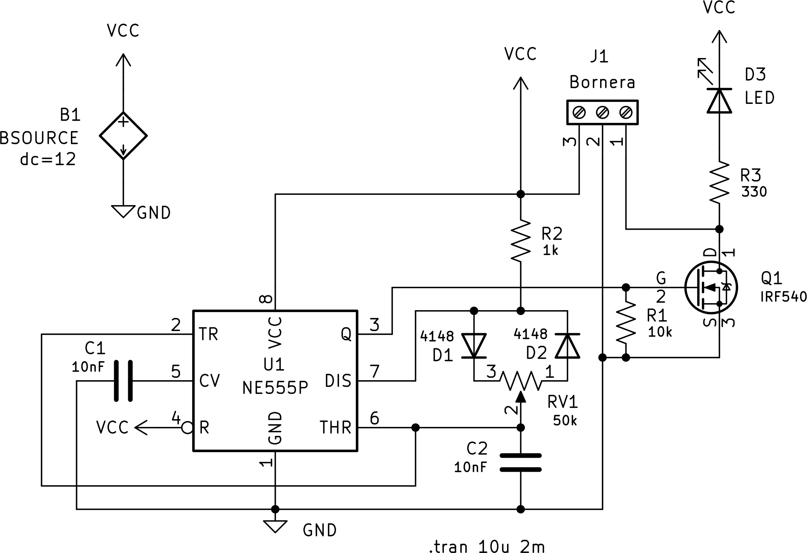
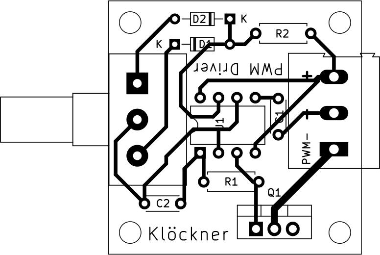

# Controlador PWM: Diseño de Placa Base y Gabinete

Introduccion al Diseño Asistido por Computadora (86.70) - FIUBA  
Martin Klöckner - [mklockner@fi.uba.ar](mailto:mklockner@fi.uba.ar)

## Introducción

En el presente trabajo se diseña la placa base y el gabinete de un controlador
modulado por ancho de pulsos (Controlador PWM en adelante). Para el diseño de
ambos componentes se utilizan programas de computadora, en particular KiCAD para
el diseño y simulacion de la placa base y FreeCAD para el diseño del gabinete y
de componentes del circuito cuyo modelo 3D no se incluyen en la librería
estandár de KiCAD.

La idea original del controlador pertence al usuario Creative Creator del
sitio web [hackster.io](hackster.io).[^1]

[^1]: Creative Creator. (2020, Marzo 17). LED Dimmer Circuit with 555 Timer. *hackster.io*. [https://www.hackster.io/dhritimanhb2015/led-dimmer-circuit-with-555-timer-bc30f7](https://www.hackster.io/dhritimanhb2015/led-dimmer-circuit-with-555-timer-bc30f7)

## Diseño de Placa Base

En la figura 1 a continuacion se muestra el esquematico completo dibujado en
KiCAD siguiendo el diseño mencionado en la introducción, además se agrega una
fuente de alimentacion de 12 volts, junto con un LED y una resistencia como
carga, esto para simular el circuito, como se muestra en la directiva de
simulacion de LTSpice.

{ width=75% }

{ width=60% }

## Diseño Gabinete

### Vista sin Tapas

\begin{figure}[H]%
  \centering
  \subfloat[\centering Frontal superior izquierda]{
    {\includegraphics[width=0.27\textwidth,height=\textheight]{
      gabinete-vistas/frente-arriba-izquierda.png
    }}
  }
  \hspace{3em}
  \subfloat[\centering Superior]{
    {\includegraphics[width=0.27\textwidth,height=\textheight]{
      gabinete-vistas/arriba.png
    }}
  }
  \hspace{3em}
  \subfloat[\centering Frontal superior derecha]{
    {\includegraphics[width=0.27\textwidth,height=\textheight]{
      gabinete-vistas/frente-arriba-derecha.png
    }}
  }

  \vspace{2em}

  \centering
  \subfloat[\centering Derecha]{
    {\includegraphics[width=0.27\textwidth,height=\textheight]{
      gabinete-vistas/derecha-izquierda.png
    }}
  }
  \hspace{3em}
  \subfloat[\centering Frontal]{
    {\includegraphics[width=0.27\textwidth,height=\textheight]{
      gabinete-vistas/frente.png
    }}
  }
  \hspace{3em}
  \subfloat[\centering Izquierda]{
    {\includegraphics[width=0.27\textwidth,height=\textheight]{
      gabinete-vistas/derecha-izquierda.png
    }}
  }

  \vspace{2em}

  \centering
  \subfloat[\centering Frontal inferior izquierda]{
    {\includegraphics[width=0.27\textwidth,height=\textheight]{
      gabinete-vistas/frente-abajo-izquierda.png
    }}
  }
  \hspace{3em}
  \subfloat[\centering Trasera]{
    {\includegraphics[width=0.27\textwidth,height=\textheight]{
      gabinete-vistas/atras.png
    }}
  }
  \hspace{3em}
  \subfloat[\centering Frontal inferior derecha]{
    {\includegraphics[width=0.27\textwidth,height=\textheight]{
      gabinete-vistas/frente-abajo-derecha.png
    }}
  }
  \caption{Vistas del Gabinete Modelado Utilizando FreeCAD}
\end{figure}

### Vista con Tapas

<!--
\begin{figure}
  \begin{subfigure}[htbp]{\linewidth}
    \centering
    \includegraphics[width=0.6\textwidth,height=\textheight]{./pcb.png}
  \end{subfigure}

  \caption{Diseño Placa Base a Partir del Circuito en KiCAD}
\end{figure}
-->

### Soporte Cables

## Construccion de la Placa Base

### Consideraciones

Por la resistencia R2 circulan aproximadamente $11 mA$ según simulación
independientemente de la carga, esta corriente circula cuando el
capcacitor C2 se descarga. Esta corriente provoca que la resistencia R2 cuyo
valor es $1000\ \Omega$ deba disipar $V_{CC}\frac{R2}{R2+RV1}\cdot 11mA$, siendo
$RV1$ el valor del potenciometro. Para el potenciometro en un $50\%$, la
potencia disipada por R2 resulta:

$$P=12V\cdot \frac{1000\Omega}{1000\Omega + 25000\Omega} \cdot 11mA = 5mW$$

Por lo que con un resistor que soporte potencia de $0.25W$ resulta mas que
suficiente.

### Materiales

* 1x Reistencia $1k\Omega$
